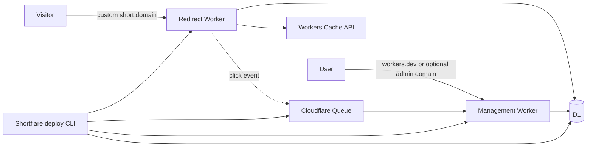
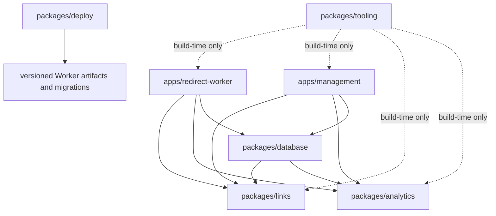

# Shortflare Architecture

This document records the target architecture agreed for Shortflare. It is the
default for implementation work; details that are explicitly marked as open may
still change without revisiting the overall shape.

## Product and architecture constraints

- Shortflare is installed into an Owner's Cloudflare account and is optimized
  exclusively for Cloudflare infrastructure.
- One Cloudflare account owns at most one Shortflare Instance.
- Installation and upgrades complete through one idempotent command:
  `npx shortflare@latest deploy`.
- An Instance supports an invite-only group of Users with Administrator,
  Member, and Viewer roles.
- Redirect availability and latency take priority over analytics ingestion.
- Management failure must not stop existing Links from redirecting.
- The MVP uses durable, deletable analytics. A high-scale analytics adapter may
  be added after the MVP without changing domain or UI code.
- The monorepo uses pnpm, Turborepo, and TypeScript 6. TypeScript 7 is
  reconsidered after the 7.1 toolchain is available.

## Runtime topology



There is no Service Binding between the two Workers. The Redirect Worker reads
Link state directly from D1 and emits analytics events to Queue. The Management
Worker owns the management HTTP endpoints, React assets, Queue consumption, and
scheduled cleanup. This keeps redirecting operational if the Management Worker
is unavailable.

### Cloudflare resources

An Instance normally has exactly these MVP resources:

- one Redirect Worker on one primary required Custom Domain, with the prior
  domain retained only during an explicitly approved domain migration;
- one Management Worker on `*.workers.dev` with an optional Custom Domain, or
  on a required Custom Domain when the account has no registered `workers.dev`
  subdomain;
- one D1 database shared by both Workers;
- one Queue produced by Redirect and consumed by Management;
- one dead-letter queue for exhausted analytics retries; and
- Workers Cache API storage, created implicitly per data center.

Workers KV is intentionally absent. Its cross-location propagation is too slow
for the desired destination-change window. Analytics Engine is not an MVP
resource.

## Request flows

### Redirect

1. Accept only `GET` and `HEAD`; return `405` for other methods.
2. Validate and extract the case-sensitive Alias.
3. Look up a synthetic Alias-only key in the data-center-local Cache API. Do
   not include visitor query parameters in this key.
4. On a miss, load the latest Link state and Destination Version from D1 and
   cache the resolution for five seconds.
5. Return `302 Found` for an Active Link, `404` for an unknown or Disabled Link,
   and `410 Gone` for an Archived Link.
6. Merge incoming query parameters into the destination. Values stored on the
   Destination Version win on name collisions.
7. For a successful `GET` redirect, schedule Click Event creation and Queue
   emission after the response. `HEAD` redirects and non-redirect responses do
   not create Click Events. Analytics failures are observed but never change
   the redirect response.

The root path returns a tiny `200 OK` installation page with
`noindex, nofollow`; it does not disclose the Management Worker address.
Destinations are limited to HTTP and HTTPS, and direct destinations on the
Instance's redirect domain are rejected to prevent obvious loops.

### Link mutation

1. A same-origin Management endpoint validates its transport schema with Zod.
2. Authentication and role checks happen before calling the Links module.
3. The module enforces Alias, state-transition, optimistic-concurrency, and
   destination invariants and returns a result instead of producing HTTP
   effects.
4. A D1 adapter persists the mutation and its audit event in one D1 batch where
   atomic batching is required.
5. Data-center caches are allowed to expire naturally within five seconds.

Changing a destination creates a Destination Version. It never overwrites the
previous destination, so Link-wide and destination-specific analytics retain
their meaning.

The internal API exposes `activate`, `disable`, `archive`, and `restore` as
explicit Link command endpoints rather than accepting a freely assigned state.
This preserves distinct transition rules and Audit Events when two commands
produce the same resulting state. The Link edit endpoint changes only the title
and Destination atomically.

The Links module exposes that edit as one `edit` command and removes the
separate `update-title` and `update-destination` commands. Both in-memory and D1
persistence adapters implement one atomic edit operation, so atomicity is a
module guarantee rather than HTTP-adapter orchestration.

The Links commands for permanent deletion and Reserved Alias release require
and validate the exact `confirmationAlias`, so every future adapter receives the
same target-confirmation guarantee. Administrator capability, recent
reauthentication, CSRF, and Origin enforcement remain Management HTTP-adapter
policies because they depend on Session and transport context.

The Link collection returns Active and Disabled Links by default. Archived
Links remain in the same collection but appear only when the caller explicitly
includes the Archived state filter; invalid or empty state filters are rejected
rather than ignored.

Link collection pagination is ordered by immutable `createdAt DESC, id ASC`;
Reserved Alias pagination uses `reservedAt DESC, alias ASC`. Cursors are
opaque, versioned, and bound to the filters and search query that produced
them. The default page size is 50, the accepted range is 1 through 100, and an
invalid or mismatched cursor is rejected rather than restarting pagination.
Mutable `updatedAt` ordering is not exposed in this slice because it can move
items across an active cursor traversal.

Management search trims one optional `search` value and performs a
Unicode-normalized, case-folded substring match across Alias and title. The
value is limited to 200 Unicode code points; repeated or oversized values are
invalid, and no wildcard, regular-expression, or token query language is
supported. This discovery behavior does not change the case-sensitive identity
or redirect resolution of an Alias.

Collection query strings are strict. Link collections accept only `search`,
repeatable `state`, `limit`, and `cursor`; Reserved Alias collections accept
only `search`, `limit`, and `cursor`. Unknown parameters, repeated single-value
parameters, non-integer or out-of-range limits, and cursors bound to another
query are rejected rather than ignored, rounded, or clamped.

Both collections return `{ ok: true, items, nextCursor }`. An empty page is a
successful empty array, and the final page uses `nextCursor: null`. The API does
not compute `total` or duplicate cursor state as `hasMore`; clients treat a
non-null cursor as the only continuation signal.

Destination Version history is a child collection of one Link, ordered by the
immutable per-Link `versionNumber DESC`. Its opaque cursor is bound to the Link
and query version, uses the same default and maximum page sizes as the other
collections, and cannot be reused for another Link. Missing Links return
`link-not-found`, Archived Link history remains readable, and there is no
separate Destination Version detail endpoint.

The history query accepts only `limit` and `cursor`. URL search, date ranges,
direct version filters, and all other parameters are rejected rather than
ignored; they can be added later only for a demonstrated client need.

The Link-management HTTP surface is:

```text
GET    /api/internal/links
POST   /api/internal/links
GET    /api/internal/links/:linkId
GET    /api/internal/links/:linkId/destination-versions
PATCH  /api/internal/links/:linkId
POST   /api/internal/links/:linkId/activate
POST   /api/internal/links/:linkId/disable
POST   /api/internal/links/:linkId/archive
POST   /api/internal/links/:linkId/restore
POST   /api/internal/links/:linkId/permanently-delete
GET    /api/internal/reserved-aliases
POST   /api/internal/reserved-aliases/:alias/release
```

Collection, creation, detail, and atomic edit use resource-oriented methods.
State transitions and destructive operations keep explicit command names;
`DELETE /links/:id` is not used because it would obscure the distinction
between archival and permanent deletion. Internal routes do not carry the
version prefix reserved for the future public API.

Link detail responses are transport DTOs containing the current Destination and
Destination Version ID, not the domain `Link` object or its complete Destination
Version history. The response also includes the Link revision required for
mutations. The complete history is available through a separate paginated
Destination Version collection in the MVP Link-management API.

List, detail, create, edit, and state-transition responses share one Link DTO:

```ts
type LinkDto = {
  id: string;
  alias: string;
  shortUrl: string;
  title: string;
  state: "active" | "disabled" | "archived";
  revision: number;
  destination: {
    id: string;
    versionNumber: number;
    url: string;
    createdAt: string;
  };
  createdAt: string;
  updatedAt: string;
};
```

The Management Worker derives `shortUrl` from the current HTTPS Redirect domain
and Alias so clients do not reconstruct installation routing rules. All DTO
timestamps are UTC ISO 8601 strings.

Destination Version history items contain `id`, `versionNumber`, `url`,
`createdAt`, and a derived `current` Boolean. The current Destination nested in
the Link DTO includes the same `versionNumber`. History items do not duplicate
Actor, Audit Event, or change-reason data, and title-only edits do not create
Destination Versions.

The history collection is read-only. Reusing a past URL goes through the normal
atomic Link edit and appends a new Destination Version with a new ID, timestamp,
and version number; no endpoint reactivates or mutates an existing Version.

Link creation accepts an optional Alias. Omitting the field requests a generated
six-character Base62 Alias; `null` and an empty string are invalid rather than
alternate spellings of omission. The response returns the selected Alias, which
cannot be changed after creation.

Successful create, edit, and state-transition responses return the latest Link
detail DTO so clients receive the authoritative revision without a follow-up
read. Edits and transitions also return whether the command changed anything;
a no-op does not increment the revision or create an Audit Event. Permanent
deletion instead returns the new Reserved Alias, and a successful Reserved Alias
release has no response body.

Atomic Link edits are strict partial updates containing `expectedRevision` and
at least one of `title` or `destination`. Omission preserves a field; `null`, an
empty edit, an Alias change, or any unknown field is invalid. Both supplied
values are validated before persistence, so one invalid value prevents the
entire edit.

A successful atomic edit creates one Audit Event whose metadata lists only the
fields that actually changed and, when applicable, the new Destination Version
ID. It does not copy old or new titles or Destination URLs. No-op, rejected,
and failed edits create no Audit Event.

All Link API failures use a discriminated `{ ok: false, kind, details }`
envelope. Invalid transport input, domain values, and Alias confirmations return
`400`; an invalid Session or inactive User returns `401`; authorization, request
integrity, and recent-authentication failures return `403`; missing resources
return `404`; and Alias, revision, or state conflicts return `409`. Stable
`kind` values drive client behavior, while localized human messages belong to
the UI and internal validation or storage details are never exposed.

Every JSON success response uses `ok: true`, and every JSON error response uses
`ok: false`; HTTP status and body discriminants may not disagree. Successful
responses do not add a redundant `kind`. The bodyless `204` Reserved Alias
release is the only exception.

The MVP internal Link API does not persist idempotency keys. Clients must not
automatically retry mutations; after an ambiguous transport failure they
refetch the relevant collection or detail before offering another command.
Durable request deduplication is deferred to the separately designed public API
or another external automation boundary.

For revision-guarded commands, the revision comparison happens before no-op
detection. A stale command returns `409 link-conflict` even if its requested
result happens to equal the current Link; the error reveals the current revision
but requires a detail refetch for current data.

### Analytics ingestion and query

1. The Click Analytics module derives a Link-scoped Pseudonymous Visitor with
   HMAC-SHA-256 from a long-lived 256-bit Instance secret, the Link ID, a fixed
   UTC half-hour bucket, and transient client IP and User-Agent values. The raw
   inputs are never stored or logged.
2. Every versioned Click Event has an immutable Event ID, Link and Destination
   Version IDs, Click Time, Pseudonymous Visitor, Referrer Domain, Country,
   Device Category, bot classification, and classification version. It excludes
   Alias, title, Destination, query parameters, cookies, the full referrer URL,
   raw IP, and raw User-Agent.
3. Bot and Device classification use deterministic local rules rather than paid
   Bot Management. Missing metadata and known crawlers, link previews,
   command-line clients, and headless automation are suspected bots. Rule
   changes increment the classification version and do not rewrite history.
4. Queue provides at-least-once delivery. Redelivery of the same Event ID and
   payload is an acknowledged no-op; the same ID with different content is an
   integrity conflict retried in isolation before dead-lettering. Invalid or
   unsupported messages are also isolated so valid batch members still commit.
5. A new raw event, its uniqueness records, and its hourly and daily rollup
   changes commit atomically. The consumer updates Link-wide and Destination
   Version scopes and independent Referrer Domain, Country, Device Category,
   and bot-classification breakdowns; the MVP does not combine dimensions.
6. Human and Unique Human Clicks are retained for totals, time series,
   Referrer, Country, and Device breakdowns. Bot breakdowns retain Human and
   Suspected Bot Clicks; suspected bots have no unique metric.
7. Raw events and Hourly Rollups expire 90 days after Click Time. Daily Rollups
   remain until Analytics Erasure or permanent Link deletion. Retention cleanup
   is exposed by the module and runs from the Management Worker's hourly Cron
   Trigger. The default schedule is `0 * * * *` UTC and an Owner may change it
   through deployment configuration. Cleanup uses the trigger's scheduled time,
   is idempotent, and reports failures to the platform so a later invocation can
   catch up; it does not create an Audit Event.
8. Analytics Erasure removes all analytics for one Link or the Instance.
   Analytics Recalculation atomically replaces one Link's rollups and uniqueness
   records for one complete UTC date, and rejects dates whose raw events are no
   longer complete.
9. Queries use aligned, half-open UTC ranges and explicit hourly or daily
   granularity. Results support Instance, Link, and Destination Version scopes,
   return zero-filled time buckets, and return only identifiers and analytics
   values. Display data is composed through Links by the Management adapter.
10. UI date ranges are stored and queried as inclusive UTC calendar dates. The
    transport converts the inclusive end date to the exclusive end of the
    module's half-open range. Hourly timestamps render in the browser's time
    zone, while Daily Rollup labels retain their UTC calendar date so they do
    not appear to move to another day.

The default dashboard excludes suspected bots and reports Human Clicks and
30-minute Unique Human Clicks separately. Bot classification and uniqueness are
approximate and must be described as such in the UI. Hourly and daily Unique
Human Clicks sum half-hour counts; Instance totals sum Link-level counts rather
than correlating a person across Links.

The read-only MVP Management transport exposes two explicit analytics
resources:

- `GET /api/internal/analytics` for the Instance; and
- `GET /api/internal/links/:linkId/analytics` for one Link.

Both require an authenticated User with the `view-analytics` capability and
accept only aligned `start`, `end`, `granularity`, and `limit` query values. The
transport rejects future ranges and ranges longer than 366 UTC dates. It does
not expose a generic scope selector or Destination Version analytics. Instance
results enrich the ten highest-ranked Link IDs through one Links module batch
query so clients do not issue one request per Link.

The Management UI keeps Links as the signed-in landing page and adds a separate
Analytics route for the Instance. Link-wide analytics appear inside Link detail;
Destination Version analytics and Analytics maintenance commands remain outside
this slice. The default range is the seven UTC dates ending today. Today uses
hourly granularity; seven-, 30-, 90-day, and custom ranges use daily
granularity, with custom ranges limited to 366 dates. Date range, selected
metric, and suspected-bot visibility are URL state.

## Modules, interfaces, and seams

The architecture favors deep modules: callers learn a small interface while
the implementation owns invariants, persistence ordering, and error mapping.
The module interface is also its primary test surface.

### Links module

`packages/links` owns:

- Alias parsing and generation;
- Link state transitions;
- Destination Version creation;
- redirect decisions;
- destination validation and query merging; and
- link creation, search, editing, archival, restoration, and permanent deletion
  rules.

Its external interface is organized around behavior rather than tables:

```ts
type Links = {
  resolve(alias: string): Promise<RedirectDecision>;
  execute(command: LinkCommand, actor: Actor): Promise<LinkResult>;
  query(query: LinkQuery, actor: Actor): Promise<LinkQueryResult>;
};
```

The persistence seam is owned by this module. D1 and in-memory adapters satisfy
it. Expected command and query failures use discriminated result types; callers
do not receive Drizzle models or issue database queries.

### Analytics modules

`packages/analytics` owns two deep modules because the Redirect and Management
Workers have different runtime responsibilities:

- the click event and bot classification vocabulary;
- HMAC-based uniqueness semantics;
- ingestion and idempotency rules;
- rollup dimensions and metric definitions; and
- analytics query results consumed by the UI and future REST endpoints.

The Redirect-facing Click Analytics module has one transport-neutral operation.
It owns event IDs, time, normalization, classification, pseudonym derivation,
wire versions, and delivery behind the interface:

```ts
type ClickAnalytics = {
  record(input: ClickObservation): Promise<ClickRecordResult>;
};
```

The Management-facing Analytics module owns ingestion, querying, and
maintenance. Expected event outcomes are returned per message; storage failures
reject the operation so the Queue adapter retries every unacknowledged message.

```ts
type Analytics = {
  ingest(events: readonly unknown[]): Promise<readonly IngestionResult[]>;
  query(query: AnalyticsQuery): Promise<AnalyticsResult>;
  execute(command: AnalyticsCommand): Promise<AnalyticsCommandResult>;
};
```

Erasure and recalculation command variants carry an Actor and atomically create
one Audit Event on success; automated retention does not. Authentication and
authorization stay in Management adapters before module calls. The MVP uses
Queue/D1 adapters and in-memory adapters for interface tests. A future Analytics
Engine delivery adapter is a real alternative at the Click Analytics seam, not
a new domain model, and continues to produce the shared result types.

### Database module

`packages/database` is an implementation module. It owns the Drizzle schema,
SQL migrations, and D1 adapters required by Links and Analytics. Its interface
constructs adapters from a D1 binding; it does not export tables as an
application-wide data model.

Production persistence adapters execute through a typed Drizzle D1 client.
Ordinary reads and writes use the SQL-like Query Builder; parameterized `sql`
templates are reserved for atomic guards and queries whose invariants are
clearer in SQL. Adapters retain existing D1 batch semantics through
`db.batch()` and do not call the underlying D1 client directly. The server-only
`@shortflare/database/d1` subpath exposes the client factory and schema solely
to D1 adapter implementations; transport, application, and domain modules do
not import it.

Drizzle is preferred over MikroORM because Drizzle directly supports D1,
Workers, and the D1 Batch API. MikroORM's D1 support is experimental and loses
the transaction-backed Unit of Work behavior that normally justifies its
larger interface.

### Management-only modules

Identity, access control, Audit Event browsing, and Instance settings remain inside
`apps/management`. They have one runtime caller, so separate workspace packages
or hypothetical external seams would add indirection without leverage. Identity
owns Initial Setup, Sessions, Invitations, Users, Password Resets, and Operator
Recovery as facets of one interface rather than flattening every method or
splitting Authentication and Users into unrelated top-level modules. Tests use
local D1 as a substitutable dependency.

The deployment CLI owns a narrow Deployment Control schema for the Deployment
Marker, Deployment Attempts, Deployment Lease, Coherent Release, and schema
compatibility metadata. It applies versioned migrations and may also write the
singleton `initial_setup` handoff before the first Administrator exists or the
singleton `operator_recovery` handoff during explicit recovery. It never writes
User, credential, Session, Link, Destination Version, Reserved Alias, Click
Event, analytics rollup, Audit Event, or other Management-owned records.

Hono and React are adapters:

- Hono maps HTTP requests, cookies, Zod schemas, and errors to module calls.
- The React SPA uses TanStack Router file-based routes and TanStack Query.
- Internal endpoints live under `/api/internal/*`.
- The later public REST surface lives under `/api/v1/*` and calls the same
  module interfaces.
- Transport schemas and generated Hono client types do not become domain types.

### Management backend composition

The Management backend is a capability-first modular monolith with a functional
application core and Hono and D1 adapters. `worker/index.ts` exports the
production app; `worker/app.ts` is the only composition root and creates it from
explicit dependencies. No route or shared transport helper constructs a D1
adapter or the production Identity module.

The composition root knows the complete graph. Each Hono sub-app receives only
the factories and ports it needs, never a generic container or the complete
dependency object. Hono Variables hold narrow request results such as the
authenticated Actor and Session state, not `services` or module instances.

Each capability exposes one chainable Hono sub-app. Handlers normally stay
beside route declarations for Hono type inference; route files split only when
independently changing HTTP resources justify it. Links groups Link and
Destination Version routes separately from Reserved Alias routes. Identity
groups authentication routes separately from User routes but retains one
application module.

Shared `transport` code is limited to policy used by at least two capability
adapters: typed Hono construction, request integrity, authentication middleware,
cookies, security headers, JSON validation mechanics, and unexpected-error
handling. Capability schemas, strict query parsing, presenters, and expected
result-to-HTTP mapping stay with their owning capability. A shared `utils` module
is not a destination for unrelated helpers.

The pure Management-local `access-control` module owns the complete Capability
union and role-to-capability mapping. It may depend on public Actor and role
types, but it does not import Hono, D1, cookies, or Identity internals. Atomic
rules that depend on stored state, such as preserving one Active Administrator,
remain in the owning application module.

Shared transport owns a narrow `RequestAuthentication` port. The production
composition root adapts the Identity Sessions facet to it, while HTTP tests use
a fake adapter. Links HTTP therefore depends on shared transport rather than on
Identity or its HTTP adapter. Authentication behavior uses purpose-named
middleware and failure presenters rather than Boolean control flags or a
service locator.

Expected application failures remain discriminated results and are mapped by
the owning capability HTTP adapter. Request-integrity, authentication, CSRF, and
Capability failures are mapped by shared transport. Only unexpected failures
reach the top-level `app.onError()`, which records them once and returns the
generic internal error. Application modules never return `Response` or import
Hono exceptions.

Dependencies point inward:

- the composition root may import all production adapters;
- HTTP adapters import public application interfaces and shared transport;
- application modules do not import Hono, D1, cookies, or transport DTOs;
- persistence adapters implement ports owned by application modules;
- modules use public entrypoints rather than deep imports; and
- re-exports must not hide circular dependencies.

## Data model

The initial relational model contains these groups. Exact columns and indexes
belong in the Drizzle schema, not this document.

| Group | Records | Important invariants |
| --- | --- | --- |
| Instance | instance metadata | exactly one row per Cloudflare account |
| Identity | initial setup and operator recovery handoffs, users, credentials, invitations, reset tokens, sessions | normalized email is unique; after setup, at least one active Administrator remains |
| Links | links, destination versions, reserved aliases, tags | Alias is case-sensitive and unique; destination history is append-only |
| Analytics | raw Click Events, uniqueness records, hourly/daily rollups, consumer checkpoints | Event ID is idempotent; raw and hourly retention is 90 days; daily rollups persist until erasure |
| Audit | administrative mutation events | actor, action, subject ID, time, and non-sensitive metadata are retained for the Instance lifetime |
| Deployment Control | Deployment Marker, Attempts, Lease, Coherent Release, schema and component identities | one immutable Instance identity; one active fenced lease; a release is coherent only after both Workers and schema are verified |

Archiving keeps the Link's Alias, analytics, and change history. Restoring an
Archived Link always produces a Disabled Link so its Destination can be
reviewed before redirects resume.

Only Archived Links can be permanently deleted. Permanent deletion removes
destinations, raw events, and rollups but replaces the Link with a Reserved
Alias that returns `410 Gone` and keeps a minimal, non-sensitive audit record.
Alias release is allowed only after permanent deletion and is a separate
Administrator-only action with reauthentication and a strong warning.
Permanent deletion and Alias release requests must also repeat the target Alias
exactly, including case. A mismatched confirmation leaves all state unchanged;
a Boolean confirmation flag is insufficient.

The internal Management API exposes Reserved Aliases as their own
Administrator-only collection rather than representing them as a Link state.
The collection supports search and cursor pagination so a Reserved Alias
remains discoverable after the permanent-deletion response is gone. Link list
and detail results never contain synthetic Reserved Alias entries.

Reserved Alias collection items and permanent-deletion responses share a DTO
containing `alias`, the server-derived `shortUrl`, `deletedLinkId`, and a UTC
ISO 8601 `reservedAt`. Reserved Alias search applies the same management
case-folding behavior to Alias only. There is no separate Reserved Alias detail
endpoint.

## Authentication and authorization

- There is no public registration. Administrators create one-time invitation
  links and deliver them manually in the MVP.
- Email and password are the MVP credential. Passwords are normalized to NFC
  and must contain 15 to 128 Unicode code points. Spaces and all other Unicode
  characters are allowed, with no composition rules; leading and trailing
  spaces remain part of the password.
- A bundled offline blocklist rejects exact matches against common or
  compromised passwords after NFC normalization. Authentication does not send
  password-derived data to an external breach-checking service.
- Setup, Invitation, Password Reset, and Operator Recovery tokens are 32 random
  bytes encoded as unpadded base64url. D1 stores only their SHA-256 hashes with
  purpose, subject, issue time, and expiry; Invitation tokens live for 24 hours
  and the other tokens for 30 minutes.
- Reissuing a token invalidates its predecessors for the same purpose and
  subject. Validation, subject state change, credential write, token
  invalidation, and Audit Event persistence are atomic, so concurrent
  submissions yield at most one success. Every invalid, expired, revoked, used,
  or state-mismatched token returns the same `400 invalid-or-expired-token`.
- Administrators create Password Reset links for Active Users and deliver them
  manually in the MVP. Issuing one revokes prior reset tokens; successful use
  changes the password and revokes every Session. Suspended Users are
  ineligible, and there is no public forgot-password endpoint.
- Invitation and Password Reset responses reveal the secret link only when it
  is issued or reissued and use `Cache-Control: no-store`. The client keeps it
  out of history and persistent storage; a lost link is rotated rather than
  retrieved.
- Setup, Invitation, Password Reset, and Operator Recovery links carry their
  secret in the URL fragment. The SPA moves it to memory, clears the fragment
  with `history.replaceState`, and submits it only in an HTTPS `POST` body;
  token values are never accepted from a request URL or written to logs or
  Audit Events. Management responses use `Referrer-Policy: no-referrer`.
- A logged-in password change requires the current password. If every
  Administrator loses access, Operator Recovery uses a separate interactive
  command that proves control of the Cloudflare account rather than reopening
  initial setup. It writes a 30-minute singleton `operator_recovery` handoff
  for one existing Active Administrator; Management consumes it to replace
  only that password, revoke all Sessions, and record a System Actor Audit
  Event. It cannot create, reactivate, or change the role of a User and has no
  non-interactive mode.
- Each login creates a separate server-side Session for that browser or device,
  identified by a 256-bit random opaque token whose hash is stored in D1.
  Sessions have a seven-day idle timeout and a 30-day absolute timeout; activity
  extends the idle deadline with at most one persistence write per hour.
- Logout revokes the current Session. Password changes and resets, suspension,
  and role changes revoke all Sessions for the affected User.
- Cancelling an Invitation removes its never-activated Invited User. Once a
  User has activated, the identity is retained: access is removed through
  suspension and restored through reactivation with the same role.
- User Emails cannot change in the MVP. An Invited User with an incorrect email
  is cancelled and invited again; an activated User whose email changes is
  suspended and replaced by a newly invited User.
- Any transition that would leave no Active Administrator, including
  suspension or demotion, is rejected atomically. Self-suspension and
  self-demotion are allowed only while another Active Administrator remains.
- The Session cookie is named `__Host-shortflare_session` and uses `Secure`,
  `HttpOnly`, `SameSite=Lax`, and `Path=/` without a `Domain` attribute. Its
  expiry never exceeds the Session's absolute deadline.
- Safe HTTP methods have no side effects. Other management requests require a
  random Session-bound CSRF token in `X-CSRF-Token` and an exact Management
  Origin match; the SPA obtains the token from an authenticated safe request
  and retains it only in memory.
- The Management API is same-origin only and emits no CORS allow headers.
  State-changing requests, including unauthenticated token and login exchanges,
  require the exact Management Origin and `application/json`; HTML form bodies
  and requests from the Redirect origin are rejected. A future `/api/v1/*`
  public API defines its own authentication and CORS boundary.
- Authenticated mutations enforce this order before any application call:
  request integrity, Session and CSRF authentication, Capability authorization,
  transport validation, and then any required recent-authentication check.
  Public Setup, login, Invitation acceptance, Password Reset use, and Operator
  Recovery use omit Session, CSRF, and Capability checks but still enforce
  request integrity before validation.
- When one request violates multiple authenticated-mutation requirements, the
  response precedence is request integrity `403`, authentication `401`,
  authorization `403`, validation `400`, and recent authentication `403`. A
  requirement derived from a validated body, such as recent authentication for
  an Administrator Invitation, runs after validation but before the application
  command.
- Each authenticated request resolves the current Session, User state, and role
  from D1. A centralized role-to-capability mapping runs in the Hono adapter
  before any module call; authenticated but unauthorized requests return `403`,
  while an invalid Session or non-Active User returns `401`. Modules receive
  the validated User as their Actor.
- Unauthenticated access is limited to the data-free SPA shell and static
  assets, a health response containing only `{"status":"ok"}`, login, initial
  Setup Token use, Invitation acceptance, Password Reset use, and Operator
  Recovery use. Every other `/api/internal/*` endpoint requires an Active User
  Session, and no User, Instance, or Link data is embedded in the public shell.
- Login returns the same `401 invalid-credentials` result for an unknown User
  Email, an Invited or Suspended User, and a wrong password. Missing
  credentials run against a fixed dummy verifier to preserve the expensive
  verification path. Failed attempts do not lock the User or create Audit
  Events; rate limits provide online-guessing protection.
- A Session must have verified its User's password within the previous ten
  minutes before granting Administrator, suspending or demoting an
  Administrator, generating a Password Reset, permanently deleting a Link, or
  releasing a Reserved Alias. Successful reauthentication rotates the Session
  token. A stale Session receives `403 reauthentication-required` without
  performing the command; changing one's own password always verifies the
  current password regardless of this window.
- Permanent Link deletion and Reserved Alias release additionally require an
  exact, case-sensitive Alias confirmation in the command. A mismatch returns
  `400 confirmation-mismatch` without performing the command.
- Audit Events record successful initial Administrator activation, Invitation
  issue, reissue, cancellation and acceptance, Password Reset issue and use,
  password change, role change, suspension, and reactivation. Login, logout,
  reauthentication, failures, and no-ops are excluded. Metadata may identify
  prior and new roles or states but never a User Email, password, token, or
  Session identifier.
- Audit Events are exposed through one Administrator-only, read-only collection
  ordered by `occurredAt DESC, id ASC`. Its opaque cursor is bound to strict
  UTC range, Actor, Action, and Subject filters. The default page size is 50,
  the maximum is 100, and one query may span at most 366 days. The UI defaults
  to the most recent 30 days and enriches retained identifiers with current
  display data when that data still exists.
- Rate limiting is best-effort abuse control rather than a global security
  invariant. It never locks a User. A coarse IP limit protects all Management
  API requests except health; credential exchange adds stricter IP and Login
  User Email budgets; privileged identity mutations and general authenticated
  Management requests use separate Actor budgets. Every rejected request uses
  the same `429 rate-limited` result and a 60-second `Retry-After` value without
  revealing which budget was exhausted.

The password hashing implementation must store an algorithm and parameters with
each hash so it can rehash on login. The exact Workers-compatible KDF is chosen
after an implementation benchmark; this does not change the authentication
module's interface.

### Role matrix

| Capability | Administrator | Member | Viewer |
| --- | ---: | ---: | ---: |
| View Links and analytics | yes | yes | yes |
| Create, edit, disable, archive, and restore Links | yes | yes | no |
| Permanently delete Links or release Aliases | yes | no | no |
| Manage Users, roles, and Instance settings | yes | no | no |
| View audit records | yes | no | no |

The authentication slice promotes the development-only
`POST /api/internal/links` route into the first production management
operation. Administrator and Member Sessions may call it, Viewer Sessions
receive `403`, and the validated User becomes the Links Actor. Its integration
test performs initial setup and login before exercising the existing
Management-to-D1-to-Redirect path.

## Monorepo layout

```text
shortflare/
├── apps/
│   ├── redirect-worker/
│   │   ├── src/
│   │   │   ├── index.ts
│   │   │   └── redirect-handler.ts
│   │   ├── test/
│   │   └── wrangler.jsonc
│   └── management/
│       ├── src/
│       │   ├── client/
│       │   │   ├── routes/
│       │   │   ├── features/
│       │   │   └── routeTree.gen.ts
│       │   └── worker/
│       │       ├── index.ts
│       │       ├── app.ts
│       │       ├── access-control/
│       │       ├── transport/
│       │       └── modules/
│       │           ├── links/
│       │           │   └── http/
│       │           ├── identity/
│       │           │   ├── application/
│       │           │   ├── adapters/d1/
│       │           │   └── http/
│       │           ├── audit/
│       │           └── instance-settings/
│       ├── test/
│       ├── vite.config.ts
│       └── wrangler.jsonc
├── packages/
│   ├── links/
│   │   ├── src/
│   │   └── test/
│   ├── analytics/
│   │   ├── src/
│   │   └── test/
│   ├── database/
│   │   ├── src/
│   │   │   ├── schema/
│   │   │   └── adapters/
│   │   └── drizzle/
│   │       └── migrations/
│   ├── deploy/
│   │   ├── src/
│   │   ├── test/
│   │   └── package.json
│   └── tooling/
│       ├── typescript/
│       ├── lint/
│       └── test/
├── docs/
│   ├── adr/
│   └── agents/
├── CONTEXT.md
├── package.json
├── pnpm-workspace.yaml
├── turbo.json
└── tsconfig.json
```

The tree is a target, not permission to create empty directories. A directory is
created when its first implementation needs it.

### Dependency direction



Rules:

- Apps compose modules; packages never import apps.
- Links and Analytics never import Database, Hono, React, or Cloudflare Worker
  entrypoints.
- Database may import Links and Analytics solely to satisfy their persistence
  interfaces.
- The client never imports Database or server-only implementations.
- Do not add `types`, `utils`, or `ui` packages until at least two real callers
  need a cohesive interface with meaningful behavior.

## Deployment and upgrades

The planned public `shortflare` npm package contains the deployment CLI,
versioned resource manifests, prebuilt Worker artifacts, and migrations. A
Release manifest declares schema and release compatibility, rollback safety,
resource templates, and the SHA-256 digest of every bundled artifact. The CLI
verifies the complete bundle before observing a mutating plan and never builds
from the current checkout or downloads deployment artifacts from another
release channel. Once publication begins, the public package uses npm trusted
publishing with provenance, and the `latest` dist-tag contains stable releases
only. It creates no second Instance in the same account.

The Public Package Surface is an explicit release contract. A committed exact
path allowlist covers the tarball, while deterministic legal verification
requires the repository MIT license and reviewed notices for every shipped
third-party dependency or asset. The package-local changelog is the single
release-note source. Its README provides enough permission, installation,
diagnosis, and recovery guidance to start without a checkout and links to the
matching version tag for the complete deployment guide. Release versions remain
manually reviewed with their compatibility declarations rather than being
calculated independently by a generic package-versioning tool.

`npx shortflare@latest deploy`:

1. authenticates to Cloudflare and discovers the one existing Instance, if any;
2. prompts for the redirect domain and, on first install, the Administrator
   email;
3. writes a non-secret local Instance config for repeatability;
4. shows the current and target versions and pending migrations;
5. creates or reconciles D1, Queue, dead-letter queue, bindings, and routes;
6. applies backward-compatible migrations;
7. deploys and verifies Management, then Redirect;
8. records the coherent Instance version;
9. on first install, creates the one-time setup token and writes the singleton
   `initial_setup` record only after the release is coherent, while no Active
   Administrator exists and the Instance has never completed setup; and
10. prints the Management address and, for an interactive installation, the
    one-time setup token.

Drizzle Kit generates reviewed, forward-only SQL migrations from the typed
schema; Wrangler lists and applies them to D1. Applied migration files are
immutable. Production upgrades export D1 before applying pending migrations,
then deploy Management before Redirect and record a coherent version only after
both Workers and the schema are compatible. Destructive changes use
expand/migrate/contract across releases; schema rollback uses the documented
restore workflow rather than down migrations.

The setup token is created only after both Workers and the schema form a
Coherent Release. It is shown only when first created in an interactive
terminal, expires after 30 minutes, is stored only as a hash in the
`initial_setup` record, and is invalidated after use. An idempotent rerun
preserves a valid pending token; expiry or explicit rotation replaces it and
invalidates the prior token. If the plaintext was not received, explicit
rotation is available only while no Active Administrator exists and setup has
never completed. Management atomically consumes the record to create the
initial User, credential, and Audit Event and permanently sets the Instance's
`setup_completed_at`; that marker is never cleared, even if data is later
damaged or restored. Non-interactive deployment requires an explicitly supplied
secret and suppresses token output.

The command is idempotent and resumable. A failure leaves the existing Redirect
deployment in place, and rerunning continues reconciliation. Destructive schema
changes use expand/migrate/contract across releases. A transitional component
state may exist during recovery, but a partial Worker upgrade is never recorded
as a Coherent Release or treated as complete.

A Coherent Release requires both control-plane and live data-plane verification.
The CLI checks the Deployment Marker, migrations, release metadata, Worker
versions and bindings, Queue producer/consumer/dead-letter and retention policy,
required secret names, and Custom Domain TLS state. It then requests the
Management health endpoint and the Redirect root. When an Active Link exists,
it sends `HEAD` to that Alias and checks the expected status and `Location`
without producing a Click Event. A bounded readiness timeout leaves the
Deployment Attempt incomplete and resumable rather than recording an unverified
release. Production verification never inserts a synthetic analytics event.

`shortflare diagnose` observes the Deployment Marker, releases and migrations,
Worker versions and bindings, Queue and dead-letter queue, domains, required
secret names, and interrupted Deployment Attempts without changing them. It
supports human-readable and JSON output. `shortflare recover` exposes only
named, separately planned recovery actions reported by diagnosis, such as
removing an Orphan Resource, rotating an unavailable Setup Token, restoring or
explicitly rotating the analytics secret, or applying a verified Worker
rollback. Routine deployment does not guess at ambiguous drift, and uninstall
is outside the MVP.

Backup commands use D1 Time Travel for recent operational recovery and SQL
export for portable backups. Every production migration requires a preceding
export. By default, the CLI writes it with user-only permissions under the
platform-standard Shortflare user data directory, grouped by Cloudflare
account; `--backup-dir` may target an encrypted external location. The CLI
never deletes these exports automatically, and Owners are advised to keep
periodic encrypted copies outside the Cloudflare account. Restore always
presents the target and impact, requires separate confirmation, pauses
Management mutations, Queue consumption, and retention cleanup, and invalidates
Sessions and one-time handoffs before traffic resumes. The full procedure lives
in `docs/operations.md`.

## Testing and verification

Verification has three observable layers:

1. Application behavior tests cross Links, Analytics, and Identity interfaces.
   Persistence contracts reuse behavioral cases against in-memory and local D1
   adapters. Tests assert decisions and results, not private helpers.
2. Capability HTTP tests call each injected Hono sub-app with `app.request()` and
   cover transport validation, authentication results, DTOs, and expected error
   mapping without constructing Hono Context objects directly.
3. Full Worker request tests use the production composition shape and local D1
   to cover routing, middleware order, cookies, CSRF, Origin, Capability and
   recent-authentication enforcement, cache behavior, Queue emission, and
   failure isolation.

Management backend changes additionally exercise the authenticated browser flows
for login, Links, and Users and require a clean browser console. A deployment
CLI pull request additionally tests the pure reconciliation planner with failure
injection, Cloudflare adapter contracts, local D1 export/import and
source-to-target migrations, JSON and exit-code contracts, and `npm pack`
artifact digests.

Before publication, the exact candidate tarball runs against a dedicated
Cloudflare account and test zone to prove fresh install, no-op rerun,
preceding-release upgrade, interrupted-stage resumption, ordered Worker
deployment, Custom Domain TLS, Queue and dead-letter behavior, and secret
preservation. Cleanup removes the consumer binding before Workers, Queues, D1,
and domains and verifies absence. Cleanup failure blocks release without
escalating to a broader deletion.

## Operations and security

- Emit structured logs with request, event, and deployment correlation IDs but
  no secrets, IP addresses, raw User-Agent values, or credentials.
- Observe Queue backlog, retry count, dead-letter count, D1 overloads, consumer
  watermark, and analytics ingestion loss.
- Consume analytics in batches of at most 10 with a one-second timeout and one
  concurrent consumer. The primary Queue and dead-letter queue retain messages
  for 24 hours. Retry failed messages three times with a 60-second delay before
  dead-lettering them. Valid batch members acknowledge independently; shared
  storage failures retry every unacknowledged member. DLQ replay is an explicit
  Owner operation that preserves Event IDs, and discard is separately confirmed.
- Rate limits protect authentication and Management requests with independent
  budgets: 300 requests per IP per minute before Management processing, 10
  credential exchanges per IP per minute, five Login attempts per normalized
  User Email per minute, 10 privileged identity mutations per Actor per minute,
  and 300 general Management requests per User per minute. Redirect abuse
  controls must prefer completing the redirect while optionally excluding the
  event from analytics.
- `ANALYTICS_HMAC_KEY` is a long-lived 256-bit Worker Secret generated once and
  preserved across deployments. Rotation is an explicit Owner operation that
  warns about a temporary Unique Human Click discontinuity. Cloudflare
  credentials and Worker Secrets never enter the repository, Instance config,
  logs, Audit Events, or D1 exports.
- Management HTTP, UI, Queue-consumer, Cron, and deployment failures do not
  affect Redirect while Redirect and D1 remain available. A warm cache may
  outlive a D1 failure, but a cache miss during a shared D1 outage returns `503`;
  the system does not claim D1-independent redirect availability.
- The deployment CLI provides a diagnostic command for resource bindings,
  deployed versions, pending migrations, Queue health, and Management reachability.
- Sentry or another external monitor is optional and outside the MVP.

## Delivery sequence

1. Workspace tooling, local runtime, D1 schema, and migration pipeline.
2. Links module and Redirect Worker without analytics.
3. Invite-only authentication, roles, and Link management endpoints.
4. React management UI using TanStack Router, TanStack Query, and the UI stack
   selected in ADR-0011.
5. Durable analytics ingestion, dimensions, retention, and dashboards.
6. Idempotent public deployment and upgrade CLI.
7. Browser end-to-end and Cloudflare deployment smoke tests.
8. Public REST endpoints, OpenAPI, UTM Builder, then high-scale analytics.

## Deliberately open details

- The password KDF and parameters, pending Workers CPU benchmarks.
- Analytics Engine implementation and mode-switch UX after the MVP.

These choices must respect the interfaces and constraints above but do not
require a new top-level package by default.

## Decision records

- [ADR-0001: Split redirect and management into separate Workers](./adr/0001-split-redirect-and-management-workers.md)
- [ADR-0002: Use durable analytics by default](./adr/0002-use-durable-analytics-by-default.md)
- [ADR-0003: Use native scrypt for password hashing](./adr/0003-use-native-scrypt-for-password-hashing.md)
- [ADR-0004: Preserve Aliases through archival](./adr/0004-preserve-aliases-through-archival.md)
- [ADR-0005: Use one D1 database per Instance](./adr/0005-use-one-d1-database-per-instance.md)
- [ADR-0006: Retain activated Users](./adr/0006-retain-activated-users.md)
- [ADR-0007: Bootstrap through a D1 handoff](./adr/0007-bootstrap-through-a-d1-handoff.md)
- [ADR-0008: Recover Administrators through a D1 handoff](./adr/0008-recover-administrators-through-a-d1-handoff.md)
- [ADR-0009: Edit a Link atomically](./adr/0009-edit-links-atomically.md)
- [ADR-0010: Reject stale Link mutations](./adr/0010-reject-stale-link-mutations.md)
- [ADR-0011: Own the Management UI through shadcn, Tailwind, and TanStack Form](./adr/0011-own-ui-components-through-shadcn-and-base-ui.md)
- [ADR-0012: Organize the Management backend by capability](./adr/0012-organize-management-backend-by-capability.md)
- [ADR-0013: Standardize runtime D1 access through Drizzle](./adr/0013-standardize-runtime-d1-access-through-drizzle.md)
- [ADR-0014: Approximate unique clicks with Link-scoped UTC buckets](./adr/0014-approximate-unique-clicks-with-link-scoped-utc-buckets.md)
