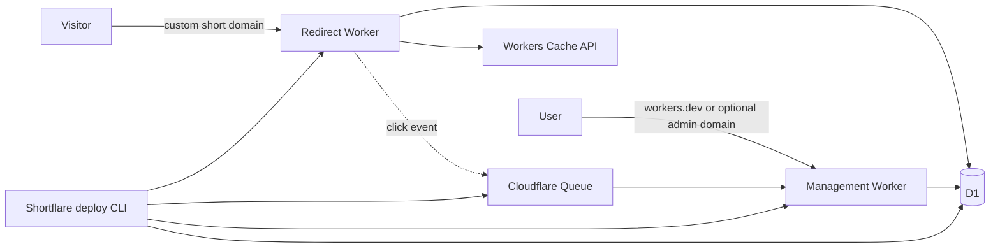
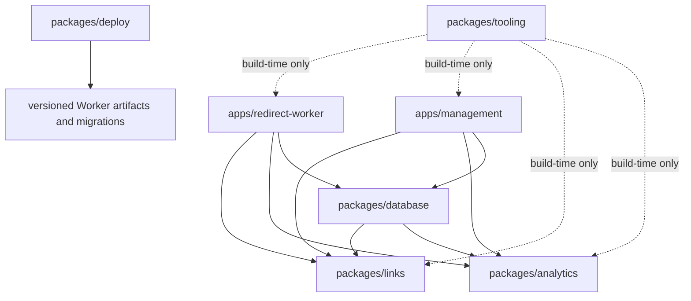

# Shortflare Architecture

This document records the target architecture agreed for Shortflare. It is the
default for implementation work; details that are explicitly marked as open may
still change without revisiting the overall shape.

## Product and architecture constraints

- Shortflare is installed into an Owner's Cloudflare account and is optimized
  exclusively for Cloudflare infrastructure.
- One Cloudflare account owns at most one Shortflare Instance.
- Installation and upgrades complete through one idempotent command:
  `npx shortflare@latest deploy`.
- An Instance supports an invite-only group of Users with Administrator,
  Member, and Viewer roles.
- Redirect availability and latency take priority over analytics ingestion.
- Management failure must not stop existing Links from redirecting.
- The MVP uses durable, deletable analytics. A high-scale analytics adapter may
  be added after the MVP without changing domain or UI code.
- The monorepo uses pnpm, Turborepo, and TypeScript 6. TypeScript 7 is
  reconsidered after the 7.1 toolchain is available.

## Runtime topology



There is no Service Binding between the two Workers. The Redirect Worker reads
Link state directly from D1 and emits analytics events to Queue. The Management
Worker owns the management HTTP endpoints, React assets, Queue consumption, and
scheduled cleanup. This keeps redirecting operational if the Management Worker
is unavailable.

### Cloudflare resources

An Instance has exactly these MVP resources:

- one Redirect Worker on one required Custom Domain;
- one Management Worker on `*.workers.dev`, with an optional Custom Domain;
- one D1 database shared by both Workers;
- one Queue produced by Redirect and consumed by Management;
- one dead-letter queue for exhausted analytics retries; and
- Workers Cache API storage, created implicitly per data center.

Workers KV is intentionally absent. Its cross-location propagation is too slow
for the desired destination-change window. Analytics Engine is not an MVP
resource.

## Request flows

### Redirect

1. Accept only `GET` and `HEAD`; return `405` for other methods.
2. Validate and extract the case-sensitive Alias.
3. Look up a synthetic Alias-only key in the data-center-local Cache API. Do
   not include visitor query parameters in this key.
4. On a miss, load the latest Link state and Destination Version from D1 and
   cache the resolution for five seconds.
5. Return `302 Found` for an Active Link, `404` for an unknown or Disabled Link,
   and `410 Gone` for an Archived Link.
6. Merge incoming query parameters into the destination. Values stored on the
   Destination Version win on name collisions.
7. Return the redirect without waiting for analytics. Schedule Queue emission
   after the response and observe emission failures.

The root path returns a tiny `200 OK` installation page with
`noindex, nofollow`; it does not disclose the Management Worker address.
Destinations are limited to HTTP and HTTPS, and direct destinations on the
Instance's redirect domain are rejected to prevent obvious loops.

### Link mutation

1. A same-origin Management endpoint validates its transport schema with Zod.
2. Authentication and role checks happen before calling the Links module.
3. The module enforces Alias, state-transition, last-write, and destination
   invariants and returns a result instead of producing HTTP effects.
4. A D1 adapter persists the mutation and its audit event in one D1 batch where
   atomic batching is required.
5. Data-center caches are allowed to expire naturally within five seconds.

Changing a destination creates a Destination Version. It never overwrites the
previous destination, so Link-wide and destination-specific analytics retain
their meaning.

### Analytics ingestion and query

1. Redirect derives a 30-minute rotating HMAC from transient request attributes
   for approximate uniqueness. Raw IP addresses and User-Agent strings are not
   stored.
2. The event contains Link and Destination Version IDs, UTC time, referrer
   domain, country, coarse device category, bot classification, and the
   short-lived pseudonymous value.
3. Queue provides buffering and at-least-once delivery. Every event has an ID;
   the consumer is idempotent.
4. The consumer groups a batch by time bucket and dimensions, inserts raw
   events, and updates rollups through D1 batch operations.
5. Raw events expire after 90 days. Daily rollups remain until explicitly
   deleted.
6. UI date ranges are stored and queried in UTC, then rendered in the browser's
   time zone.

The default dashboard excludes suspected bots and reports Human Clicks and
30-minute Unique Human Clicks separately. Bot classification and uniqueness are
approximate and must be described as such in the UI.

## Modules, interfaces, and seams

The architecture favors deep modules: callers learn a small interface while
the implementation owns invariants, persistence ordering, and error mapping.
The module interface is also its primary test surface.

### Links module

`packages/links` owns:

- Alias parsing and generation;
- Link state transitions;
- Destination Version creation;
- redirect decisions;
- destination validation and query merging; and
- link creation, search, editing, archival, restoration, and permanent deletion
  rules.

Its external interface is organized around behavior rather than tables:

```ts
type Links = {
  resolve(alias: string): Promise<RedirectDecision>;
  execute(command: LinkCommand, actor: Actor): Promise<LinkResult>;
  query(query: LinkQuery, actor: Actor): Promise<LinkPage | LinkDetail>;
};
```

The persistence seam is owned by this module. D1 and in-memory adapters satisfy
it. Callers do not receive Drizzle models or issue database queries.

### Analytics module

`packages/analytics` owns:

- the click event and bot classification vocabulary;
- HMAC-based uniqueness semantics;
- ingestion and idempotency rules;
- rollup dimensions and metric definitions; and
- analytics query results consumed by the UI and future REST endpoints.

Its main interface is intentionally small:

```ts
type Analytics = {
  record(event: ClickEvent): Promise<void>;
  query(query: AnalyticsQuery, actor: Actor): Promise<AnalyticsResult>;
};
```

The MVP uses Queue/D1 adapters. A future Analytics Engine adapter is a real
alternative at the same seam, not a new domain model. Both modes share the D1
rollup schema and result types.

### Database module

`packages/database` is an implementation module. It owns the Drizzle schema,
SQL migrations, and D1 adapters required by Links and Analytics. Its interface
constructs adapters from a D1 binding; it does not export tables as an
application-wide data model.

Drizzle is preferred over MikroORM because Drizzle directly supports D1,
Workers, and the D1 Batch API. MikroORM's D1 support is experimental and loses
the transaction-backed Unit of Work behavior that normally justifies its
larger interface.

### Management-only modules

Authentication, Users, roles, sessions, audit browsing, and Instance settings
remain inside `apps/management`. They have one runtime caller and one D1
implementation, so separate workspace packages or hypothetical external seams
would add indirection without leverage. Tests use local D1 as a substitutable
dependency.

Hono and React are adapters:

- Hono maps HTTP requests, cookies, Zod schemas, and errors to module calls.
- The React SPA uses TanStack Router file-based routes and TanStack Query.
- Internal endpoints live under `/api/internal/*`.
- The later public REST surface lives under `/api/v1/*` and calls the same
  module interfaces.
- Transport schemas and generated Hono client types do not become domain types.

## Data model

The initial relational model contains these groups. Exact columns and indexes
belong in the Drizzle schema, not this document.

| Group | Records | Important invariants |
| --- | --- | --- |
| Instance | instance metadata and deployed version | exactly one row per Cloudflare account |
| Identity | users, credentials, invitations, reset tokens, sessions | normalized email is unique; at least one active Administrator remains |
| Links | links, destination versions, reserved aliases, tags | Alias is case-sensitive and unique; destination history is append-only |
| Analytics | raw click events, deduplication keys, hourly/daily rollups, consumer checkpoints | event ID is idempotent; raw retention is 90 days |
| Audit | administrative mutation events | actor, action, subject ID, time, and non-sensitive metadata are retained |
| Deployment | schema and application version metadata | both Workers must be compatible with the recorded schema version |

Archiving keeps the Link's Alias, analytics, and change history. Restoring an
Archived Link always produces a Disabled Link so its Destination can be
reviewed before redirects resume.

Only Archived Links can be permanently deleted. Permanent deletion removes
destinations, raw events, and rollups but replaces the Link with a Reserved
Alias that returns `410 Gone` and keeps a minimal, non-sensitive audit record.
Alias release is allowed only after permanent deletion and is a separate
Administrator-only action with reauthentication and a strong warning.

## Authentication and authorization

- There is no public registration. Administrators create one-time invitation
  links and deliver them manually in the MVP.
- Email and password are the MVP credential. Passwords require at least eight
  characters and no composition rules.
- Invitation tokens live for 24 hours; reset tokens live for 30 minutes. Only
  token hashes are stored and every token is single-use.
- Sessions have a seven-day idle timeout and a 30-day absolute timeout.
- Password, suspension, and role changes revoke existing sessions.
- The last active Administrator cannot be suspended, deleted, or demoted.
- Secure, HTTP-only, same-site cookies and CSRF protection guard management
  endpoints.
- Authentication, invitation, reset, and management endpoints are rate-limited.

The password hashing implementation must store an algorithm and parameters with
each hash so it can rehash on login. The exact Workers-compatible KDF is chosen
after an implementation benchmark; this does not change the authentication
module's interface.

### Role matrix

| Capability | Administrator | Member | Viewer |
| --- | ---: | ---: | ---: |
| View Links and analytics | yes | yes | yes |
| Create, edit, disable, archive, and restore Links | yes | yes | no |
| Permanently delete Links or release Aliases | yes | no | no |
| Manage Users, roles, and Instance settings | yes | no | no |
| View audit records | yes | no | no |

## Monorepo layout

```text
shortflare/
├── apps/
│   ├── redirect-worker/
│   │   ├── src/
│   │   │   ├── index.ts
│   │   │   └── redirect-handler.ts
│   │   ├── test/
│   │   └── wrangler.jsonc
│   └── management/
│       ├── src/
│       │   ├── client/
│       │   │   ├── routes/
│       │   │   ├── features/
│       │   │   └── routeTree.gen.ts
│       │   └── worker/
│       │       ├── index.ts
│       │       ├── http/
│       │       │   ├── internal/
│       │       │   └── v1/
│       │       └── modules/
│       │           ├── auth/
│       │           ├── users/
│       │           ├── audit/
│       │           └── instance-settings/
│       ├── test/
│       ├── vite.config.ts
│       └── wrangler.jsonc
├── packages/
│   ├── links/
│   │   ├── src/
│   │   └── test/
│   ├── analytics/
│   │   ├── src/
│   │   └── test/
│   ├── database/
│   │   ├── src/
│   │   │   ├── schema/
│   │   │   └── adapters/
│   │   └── drizzle/
│   │       └── migrations/
│   ├── deploy/
│   │   ├── src/
│   │   ├── test/
│   │   └── package.json
│   └── tooling/
│       ├── typescript/
│       ├── lint/
│       └── test/
├── docs/
│   ├── adr/
│   └── agents/
├── CONTEXT.md
├── package.json
├── pnpm-workspace.yaml
├── turbo.json
└── tsconfig.json
```

The tree is a target, not permission to create empty directories. A directory is
created when its first implementation needs it.

### Dependency direction



Rules:

- Apps compose modules; packages never import apps.
- Links and Analytics never import Database, Hono, React, or Cloudflare Worker
  entrypoints.
- Database may import Links and Analytics solely to satisfy their persistence
  interfaces.
- The client never imports Database or server-only implementations.
- Do not add `types`, `utils`, or `ui` packages until at least two real callers
  need a cohesive interface with meaningful behavior.

## Deployment and upgrades

The published `shortflare` npm package contains the deployment CLI, versioned
resource manifests, Worker artifacts, and migrations. It creates no second
Instance in the same account.

`npx shortflare@latest deploy`:

1. authenticates to Cloudflare and discovers the one existing Instance, if any;
2. prompts for the redirect domain and, on first install, the Administrator
   email;
3. writes a non-secret local Instance config for repeatability;
4. shows the current and target versions and pending migrations;
5. creates or reconciles D1, Queue, dead-letter queue, bindings, and routes;
6. applies backward-compatible migrations;
7. deploys Management, then Redirect;
8. records the coherent Instance version; and
9. prints the Management address and a one-time initial setup token.

The setup token is shown only in an interactive terminal, expires quickly, is
stored only as a hash, and is invalidated after use. Non-interactive deployment
requires an explicitly supplied secret and suppresses token output.

The command is idempotent and resumable. A failure leaves the existing Redirect
deployment in place, and rerunning continues reconciliation. Destructive schema
changes use expand/migrate/contract across releases. Partial Worker upgrades are
not supported.

Backup commands use D1 Time Travel for recent operational recovery and SQL
export for portable backups. Restore always presents the target and impact and
requires separate confirmation.

## Testing and verification

MVP verification has three layers:

1. Links and Analytics behavior tests cross their module interfaces with
   in-memory adapters. Tests assert decisions and results, not implementation
   internals.
2. D1 adapter contract and migration tests run against the local Workers/D1
   runtime and reuse the same behavioral cases.
3. Worker request tests cover routing, cookies, role enforcement, cache behavior,
   Queue emission, and failure isolation.

Browser end-to-end tests are added after the core UI stabilizes. A deployment
smoke test against a dedicated Cloudflare account follows once the CLI is safe
and idempotent.

## Operations and security

- Emit structured logs with request, event, and deployment correlation IDs but
  no secrets, IP addresses, raw User-Agent values, or credentials.
- Observe Queue backlog, retry count, dead-letter count, D1 overloads, consumer
  watermark, and analytics ingestion loss.
- Rate limits protect authentication and management mutations. Redirect abuse
  controls must prefer completing the redirect while optionally excluding the
  event from analytics.
- The deployment CLI provides a diagnostic command for resource bindings,
  deployed versions, pending migrations, Queue health, and Management reachability.
- Sentry or another external monitor is optional and outside the MVP.

## Delivery sequence

1. Workspace tooling, local runtime, D1 schema, and migration pipeline.
2. Links module and Redirect Worker without analytics.
3. Invite-only authentication, roles, and Link management endpoints.
4. React management UI using TanStack Router and TanStack Query.
5. Durable analytics ingestion, dimensions, retention, and dashboards.
6. Idempotent public deployment and upgrade CLI.
7. Browser end-to-end and Cloudflare deployment smoke tests.
8. Public REST endpoints, OpenAPI, UTM Builder, then high-scale analytics.

## Deliberately open details

- UI styling system and visual component source.
- The password KDF and parameters, pending Workers CPU benchmarks.
- The concrete rate-limit adapter and initial thresholds.
- Analytics Engine implementation and mode-switch UX after the MVP.

These choices must respect the interfaces and constraints above but do not
require a new top-level package by default.

## Decision records

- [ADR-0001: Split redirect and management into separate Workers](./adr/0001-split-redirect-and-management-workers.md)
- [ADR-0002: Use durable analytics by default](./adr/0002-use-durable-analytics-by-default.md)
